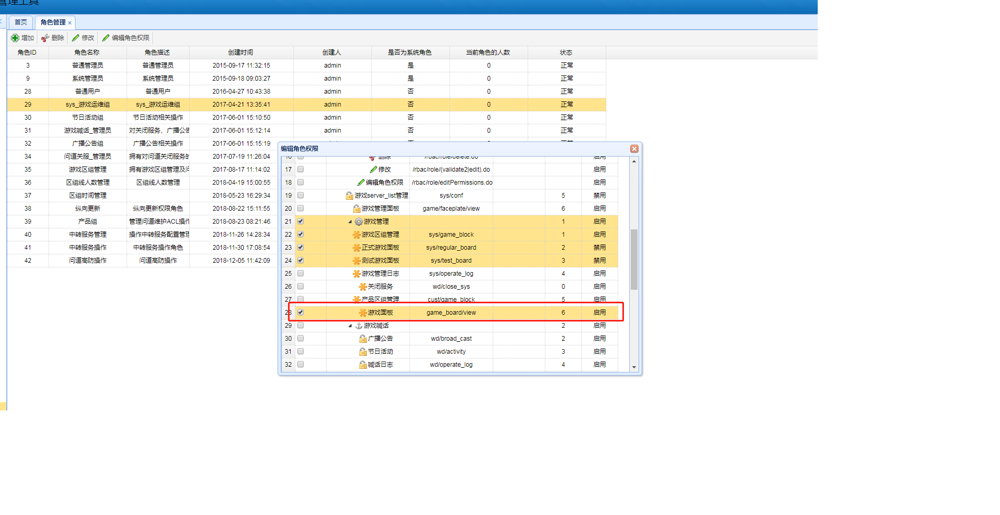

#游戏管理工具  2019年1月14日

##游戏面板节点

######基础业务
	1.查询并拉取线上配置文件（例 global_distlist.txt、global_verpath.ini）
	2.生成本地配置文件,
	3.可编辑修改本地配置文件
	4.展示线上本地配置文件异同
	5.推送本地配置文件替换线上配置文件
	6.根据替换文件,重新计算该文件Md5值，修改线上记录文件

######使用说明
    1.游戏面板节点默认不可见，需分配权限可见该节点
    
    2.游戏面板节点内默认为空，需分配权限可见对应游戏操作面板
    
    3.打开对应游戏操作面板，左侧默认为本地配置文件，右侧默认为线上配置文件
    

######代码逻辑
    1.

######重点说明

######特殊说明

