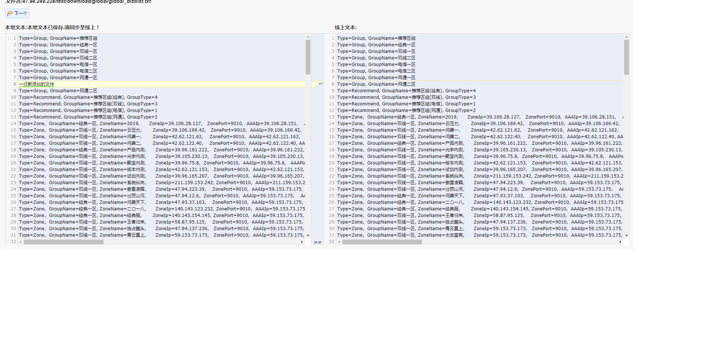

# 游戏管理工具  2019年1月14日

## 游戏面板节点

###### 基础业务
	1. 查询并拉取线上配置文件（例 global_distlist.txt、global_verpath.ini）
	2. 生成本地配置文件,
	3. 可编辑修改本地配置文件
	4. 展示线上本地配置文件异同
	5. 推送本地配置文件替换线上配置文件
	6. 根据新配置文件,重新计算该文件Md5值，修改线上记录文件
	7. 根据新配置文件生成对应压缩文件（rar格式），一并同步到线上

###### 使用说明
	1. 游戏管理面板节点可以配置游戏操作面板
	
	2. 点击编辑可以修改操作面板的参数
	
    	* 文件地址：获取配置文件下载地址
    	* md5文件名：需重新计算Md5值的记录文件
    	* 同步IP：推送配置文件的同步IP
    	* 同步地址：推送配置文件的同步地址
    	* 压缩文件名：是否生成对应的压缩文件，已经生成压缩文件的名称
    	* 写入global_filesmap：是否修改global_filesmap中的文件Md5值
    	* 写入global_md5：是否修改global_md5中的文件Md5值
    	* 备注：备注信息
    3. 游戏面板节点默认不可见，需分配权限可见该节点
    
    4. 游戏面板节点内默认为空，需分配权限可见对应游戏操作面板
    
    5. 打开对应游戏操作面板，左侧默认为本地配置文件，右侧默认为线上配置文件,
    
    6. 本地配置文件和线上配置文件不同处会高亮显示
    7. 当点击下一个按钮时，无论本地配置文件修改多少次，会保存当前输入框中的内容作为本地配置文件内容
    8. 当点击同步按钮时，开始执行游戏面板操作的所有流程

###### 代码逻辑
    1.

###### 重点说明

###### 特殊说明

